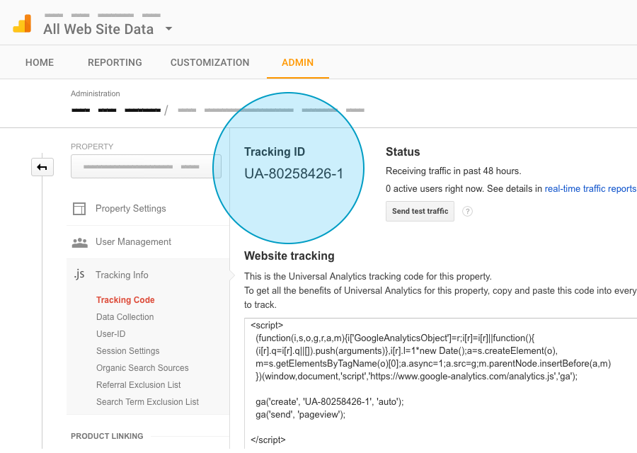
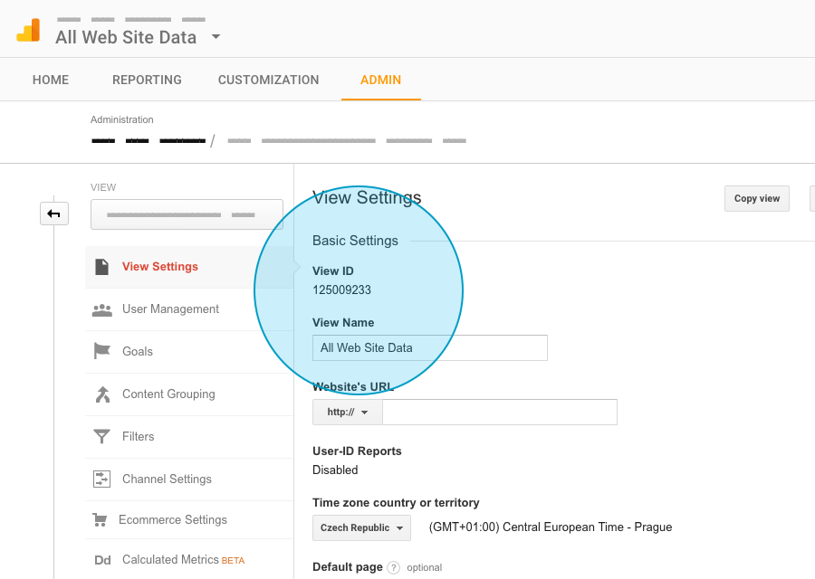
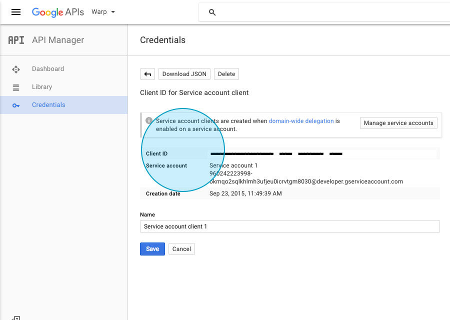
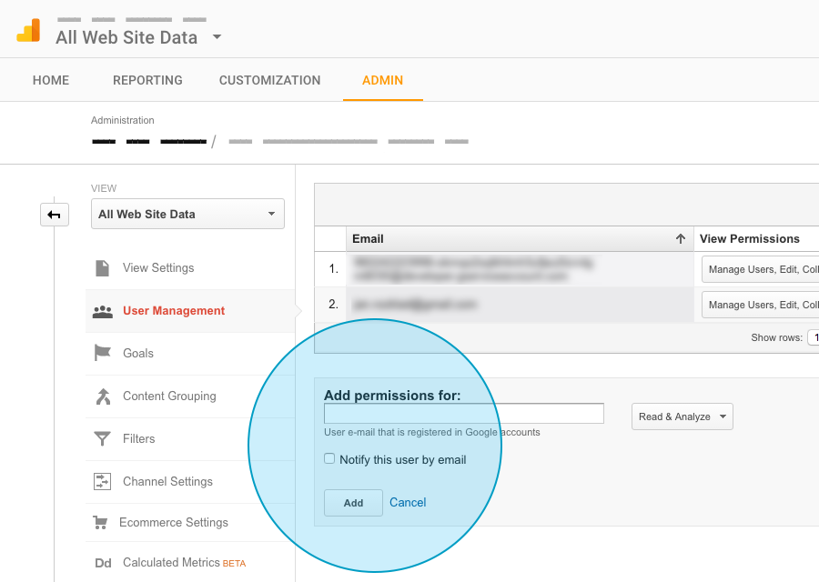

# sanatorium/analytics

Package to retrieve Google Analytics data for Cartalyst Platform

## Contents

1. [Documentation](#documentation)
    - [Configuration](#configuration)
2. [Changelog](#changelog)
3. [Support](#support)
4. [Hooks](#hooks)

## Documentation

### Configuration

#### Universal Analytics ID

**Admin > Property > Tracking Info > Tracking Code**

Should look like UA-XXXXXXXX-X

#### Site ID

**Admin > View > View Settings > View ID**

Copy the View ID and prefix that with "ga:"

Should look like: ga:xxxxxxxx

 
#### Client ID

Provide Client ID of Google account with Google Analytics API enabled. You will also get service email there, note that down, it's used in Service E-mail.

#### Service E-mail

Service E-mail of the Google Account, this also needs to be added to **Admin > View > User Settings** as a user with atleast permission to read.

#### Certificate .p12

Path to .p12 certificate, to obtain:

- **Open the project, go to APIs & auth > Credentials**
- **Click on Create new Client ID, and select Service account and P12 key. Then click on Create Client ID to download it.**

#### Map mode

Area to show in map widget.

#### Track admin area

Enable/Disable analytics for admin area (helps us improve the user experience).

#### Universal Analytics ID (admin)

Should look like UA-XXXXXXXX-X, default value

    UA-71753817-1

## Changelog

- 1.3.0 - 2016-08-06 - Readme, expections

## Support

Support not available.

## Hooks

List of currently used hooks:

    'scripts.footer' => 'sanatorium/analytics::hooks.trackingCode',
    'admin.scripts.footer' => 'sanatorium/analytics::hooks.trackingCodeAdmin',
    